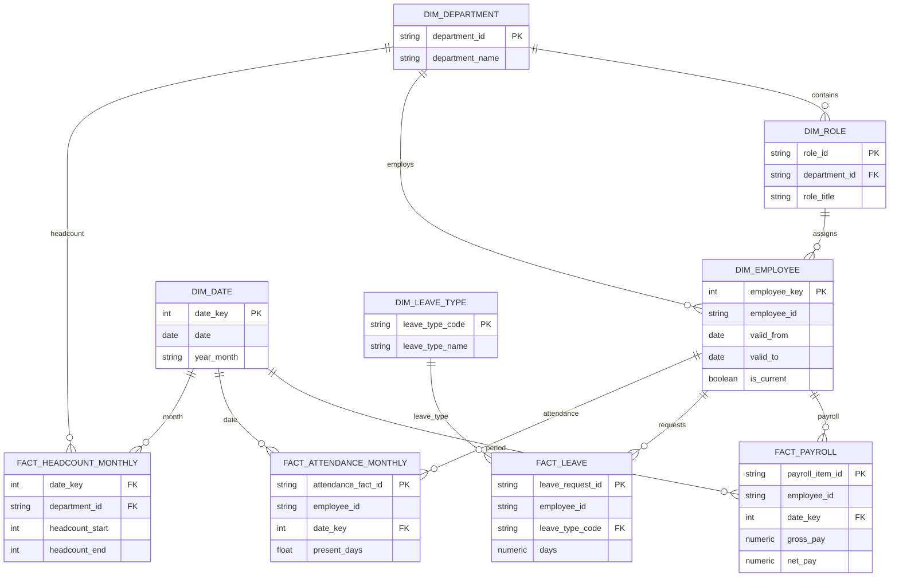


# PulseIQ Analytics Warehouse - Schema Diagram

```mermaid
erDiagram
    DIM_DEPARTMENT ||--o{ DIM_ROLE : contains
    DIM_DEPARTMENT ||--o{ DIM_EMPLOYEE : employs
    DIM_ROLE ||--o{ DIM_EMPLOYEE : assigns
    DIM_EMPLOYEE ||--o{ FACT_PAYROLL : payroll
    DIM_EMPLOYEE ||--o{ FACT_LEAVE : requests
    DIM_EMPLOYEE ||--o{ FACT_ATTENDANCE_MONTHLY : attendance
    DIM_DEPARTMENT ||--o{ FACT_HEADCOUNT_MONTHLY : headcount
    DIM_DATE ||--o{ FACT_PAYROLL : period
    DIM_DATE ||--o{ FACT_ATTENDANCE_MONTHLY : date
    DIM_DATE ||--o{ FACT_HEADCOUNT_MONTHLY : month
    DIM_LEAVE_TYPE ||--o{ FACT_LEAVE : leave_type

    DIM_DEPARTMENT {
        string department_id PK
        string department_name
    }

    DIM_ROLE {
        string role_id PK
        string department_id FK
        string role_title
    }

    DIM_DATE {
        int date_key PK
        date date
        string year_month
    }

    DIM_LEAVE_TYPE {
        string leave_type_code PK
        string leave_type_name
    }

    DIM_EMPLOYEE {
        int employee_key PK
        string employee_id
        date valid_from
        date valid_to
        boolean is_current
    }

    FACT_PAYROLL {
        string payroll_item_id PK
        string employee_id
        int date_key FK
        numeric gross_pay
        numeric net_pay
    }

    FACT_LEAVE {
        string leave_request_id PK
        string employee_id
        string leave_type_code FK
        numeric days
    }

    FACT_ATTENDANCE_MONTHLY {
        string attendance_fact_id PK
        string employee_id
        int date_key FK
        float present_days
    }

    FACT_HEADCOUNT_MONTHLY {
        int date_key FK
        string department_id FK
        int headcount_start
        int headcount_end
    }
```
